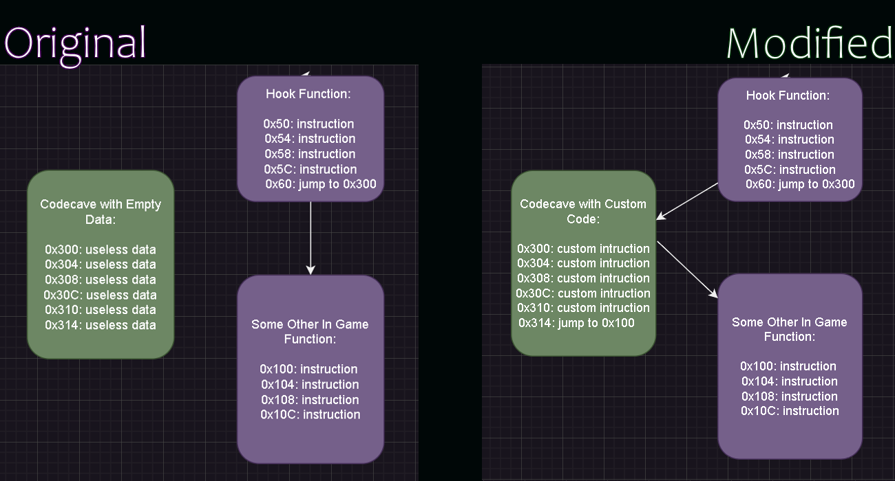

# C/C++ Game Modding Utility

**This utility aims to make writing mods/hacks for games in C/C++ easier.** It streamlines the process of compiling C/C++ with the intention of being injecting into a game, which is a seperate already compiled binary. 

#### This utility currently supports:
- Playstation 1 Games
- Playstation 2 Games
- Gamecube Games
- Wii Games*
- N64 Games* *(needs further testing)*

## Quick Start:

#### Creating a Project
To get started, you'll need to create a project for your game mod.
Once you have created a project choose your games platform, and ***main executable file***. 
##### Main Executable File
* For PS1/PS2 games, the executable should start with **SCUS**, **SCES**, 
**SLUS**, **SLES**, etc
* For Gamecube/Wii games, the executable should be named **Start.dol or main.dol**

Next, you'll need to find a ***code cave(s)*** to place your mod code, and a ***hook*** to jump to it.
#### Code Caves and Hooks
At a high level, here is how injecting compiled mods into games using this utility works:
1.  **Code caves:** First things first, we need a place in the games ram to actually insert our mod code. The easiest way is to look for unused/free sections of the games main executable, that also still happens to get loaded into ram. These free sections are called [code caves.](https://en.wikipedia.org/wiki/Code_cave)  *These can unused/debug strings, unused functions/code, sometimes a block of 0's, etc*
2. **Hooks:** Once you have found a code cave to place your custom mod code into, you'll need a way to get the game to actually run it! This is where a [hook](https://en.wikipedia.org/wiki/Hooking#:~:text=Function%20hooking%20is%20implemented%20by,injected%20code) comes in. A hook is a function in the original game that *usually* gets ran every frame. We can modify this function to also jump to our custom code, so that our custom code runs whenever the hooked function runs. So if our hook runs every frame, so will our custom code! (*This utility attempts to automatically find hooks for some platforms*)

Here is a very basic visual of the concept:

As seen here, we are simply redirecting the games instruction flow to jump to our custom code, and then jumping right back to where it planned to go initially.

Once you have found a codecave to place your mod code, and a hook to jump to it, you are ready to start writing mods for your game of choice! 

#### Writing Mods
When writing mods for a game, ultimately all we are doing is **changing values in memory**, or **changing the flow of instructions**. So how do we talk with in game memory addresses in our code directly?
##### Symbols
- **Symbols:** Symbols are in game variables that you want to use, and in game functions you want to call. You can use memory seraching tools similar to Cheat Engine, in combination with debugging emulators and decompilation tools like Ghidra in order to find in game symbols.

Once you have found symbols you want to use in your mod, you can simply use the **in_game** keyword in order to declare them in your C/C++ code for use like so:

```c
//In Game Variables
in_game short coins; 	 	//0x8080DD84
in_game short lives; 	 	//0x8080DD86
in_game int jump_height;	//0x8080DD00
in_game int player_position[3]; //0x8080DC00

//In Game Functions
in_game int ReturnCompletionPercentage(void); 	 	//0x800501C0
in_game void DrawText(char* text_string, int x, int y); //0x80048250

```
*Note that you MUST put the memory address of the symbol as a // comment next to the declaration.*

Once you declare the symbols as **in_game** variables/functions, you can use them in your code like any other variable/function:
```c
//Mod Code
void MainHook(void) 
{
    int percentage = ReturnCompletionPercentage();
    if (percentage >= 50)
    {
        lives = 99;
        jump_height *= 2;
        DrawText("Mod Activated!", 10, 30);
    }
    return;
}
```

## Recommended Tools
 - [Ghidra](https://github.com/NationalSecurityAgency/ghidra/releases) is a swiss army knife for reverse engineering. In combination with the plugins below, it can make decompilation a much nicer experience:
 ~ [PS1 Ghidra Plugin](https://github.com/lab313ru/ghidra_psx_ldr)
 ~ [PS2 Ghidra Plugin](https://github.com/chaoticgd/ghidra-emotionengine-reloaded)
 ~ [Gamecube/Wii Ghidra Plugin](https://github.com/Cuyler36/Ghidra-GameCube-Loader)
 - [Bizhawk](https://github.com/TASEmulators/BizHawk) for memory searching in PS1 games
 - [Cheat Engine](https://github.com/cheat-engine/cheat-engine) for memory searching in PS2 games
 - [Dolphin Memory Engine](https://github.com/aldelaro5/Dolphin-memory-engine) for memory searching in Gamecube/Wii games
- [VSCode](https://github.com/microsoft/vscode) or [Sublime](https://www.sublimetext.com/) text editors, for automatic integration with projects.
## Bundled Tools / Special Thanks
 - [devkitPro](https://github.com/devkitPro) for GCC toolchains targeted towards Gamecube/Wii PPC, as well as utilities for analyzing .dol files.
 - [GCR](https://github.com/bsv798/gcrebuilder) for extracting/rebuilding Gamecube games
 - [mkpsxiso](https://github.com/Lameguy64/mkpsxiso) for extracting/rebuilding PS1 games
  - [7zip](https://github.com/mcmilk/7-Zip) for solving life's greatest mysteries

## Contact

If you need any help using this utility, feel free to reach out to me on discord: **Composer** :)
